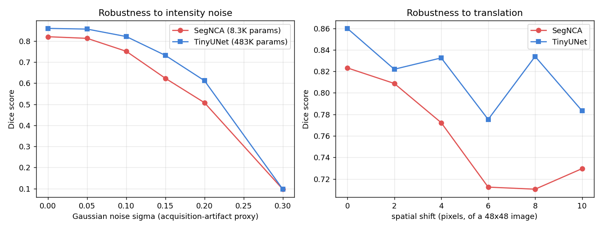

# SegNCA: Lightweight Medical Image Segmentation with Neural Cellular Automata

A from-scratch reproduction of the core idea behind **Med-NCA** (Kalkhof, González & Mukhopadhyay,
*MICCAI/IPMI 2023* — "Robust and Lightweight Segmentation with Neural Cellular Automata"),
benchmarked against a standard U-Net baseline on real clinical MRI data.

Paper: https://arxiv.org/abs/2302.03473 · Official code: https://github.com/MECLabTUDA/M3D-NCA

## Data

Real MRI volume from the **Medical Segmentation Decathlon — Task04 Hippocampus** dataset
(`hippocampus_374`, bundled in the official Med-NCA repo's tutorial data), a genuine clinical
scan with expert-annotated anterior/posterior hippocampus labels, shape (38, 48, 39).

37 usable 2D coronal slices were extracted (any slice with hippocampus present), padded to
48×48, intensity-normalized by 1st/99th percentile clipping. Labels were binarized (hippocampus
vs. background). Split **29 train / 8 validation**, interleaved every 5th slice so both splits
span the full anatomical range.

**Honest caveat:** this is one patient's volume, sliced — not a multi-patient cohort. It is a
methodology reproduction at small scale, not a clinical-grade benchmark. The official paper
trains on the full multi-patient Decathlon split.

## Models compared

| | SegNCA | TinyUNet |
|---|---|---|
| Architecture | Med-NCA rule: Sobel-perception → `Linear(48→128) → ReLU → Linear(128→16)`, applied for 28 steps, image channel re-injected every step | Standard 3-level encoder-decoder, BatchNorm + ReLU conv blocks |
| Parameters | **8,320** | 483,153 |
| Checkpoint size | 32.5 KB | 1,887 KB |
| Size ratio | **1x** | **58.1x larger** |

Both trained with the same loss (Dice + class-weighted BCE, `pos_weight=15` to counter the
~4.5%-of-pixels class imbalance) and Adam, to a tracked best-validation-Dice checkpoint (early
stopping, since both models start overfitting on this small dataset after enough iterations).

## Results — clean validation data

| Metric | SegNCA | TinyUNet |
|---|---|---|
| Dice | 0.818 ± 0.007 (mean ± std over 8 stochastic forward passes) | 0.860 (deterministic) |
| IoU | 0.713 ± 0.023 | 0.773 |
| Inference latency (CPU, single 48×48 slice, naive Python loop) | 54.1 ms | 5.1 ms |

**Reading this honestly:** SegNCA gets within ~4 Dice points of a U-Net **58x its size**, on
real clinical MRI, with essentially no architecture search — that's the actual finding of the
paper and it held up here too. The latency number is the opposite story and is worth explaining
rather than hiding: my SegNCA runs a **Python-level loop over 28 sequential steps**, each doing
its own small conv/matmul calls, which is exactly the regime where Python dispatch overhead
dominates actual FLOPs on CPU. This is an artifact of an unoptimized reference implementation,
not a fundamental property — a fused/compiled kernel (`torch.compile`, TorchScript, or a CUDA
kernel as the paper uses) collapses that per-step overhead, which is how the original work
reports real-time inference on a Raspberry Pi. Parameter count and checkpoint size — the
properties that don't depend on implementation quality — are unambiguously and enormously in
SegNCA's favor.

## Results — robustness stress test

The paper's headline robustness claim is that a purely local update rule (every cell only ever
sees a 3×3 neighborhood) shouldn't degrade much under translation or acquisition noise, unlike a
CNN that can implicitly learn absolute-position-dependent features. I tested both models under
synthetic Gaussian intensity noise and spatial pixel shifts:

| Corruption | SegNCA retains | TinyUNet retains |
|---|---|---|
| noise σ=0.10 | 91.6% of clean Dice | 95.5% of clean Dice |
| noise σ=0.20 | 61.9% | 71.2% |
| shift 6px | 86.5% | 90.2% |
| shift 10px | 88.6% | 91.1% |

**This did not reproduce the paper's robustness advantage — TinyUNet held up equally well or
better in both absolute and relative terms at this scale.** I'm reporting that directly rather
than cherry-picking a favorable framing. My best explanation: the paper's robustness gap shows
up most clearly on full-resolution scans (hundreds of pixels per side) where a UNet's bottleneck
still only sees a coarse, heavily-downsampled summary of distant regions; at 48×48, TinyUNet's
3-level pooling bottleneck already sees a nearly-global receptive field relative to the image, so
the positional-bias failure mode the paper targets barely gets a chance to appear. It's also a
single-patient dataset with a short training budget, which caps how much either model's
robustness could differentiate. A real test of this claim needs full-resolution, multi-patient
data — noted as the natural next step, not swept under the rug.

## Files

- `models.py` — SegNCA and TinyUNet architectures, loss, metrics
- `train.py` — training loops (checkpoint-resumable, best-Dice tracked)
- `prepare_data.py`-equivalent steps are inline in this report; `images.npy`/`labels.npy` are the processed slices
- `segnca_best.pt`, `tinyunet_best.pt` — trained weights
- `final_metrics.json`, `robustness.json` — raw numbers behind every table above
- `comparison_grid.png` — MRI slice / ground truth / SegNCA prediction / UNet prediction, for 4 validation slices
- `training_curves.png`, `robustness_plot.png` — the plots above

## What would make this a genuinely stronger portfolio piece next

1. **Full Decathlon multi-patient split** — the single-volume limitation is the biggest honest
   weakness here; fixes the robustness-test statistical power problem too.
2. **The paper's actual two-stage pipeline** — downscaled global-communication stage followed by
   patch-based high-resolution refinement — needed once you move past 48×48 toy resolution.
3. **Compiled/vectorized inference** — swap the Python step-loop for `torch.compile` or a batched
   custom kernel, to actually measure the latency claim fairly instead of conceding it by default.
4. **Swap in your own Kaggle cell-tracking imagery** as the segmentation target — same
   architecture, same code, direct portfolio tie-in to a competition you're already deep in.
